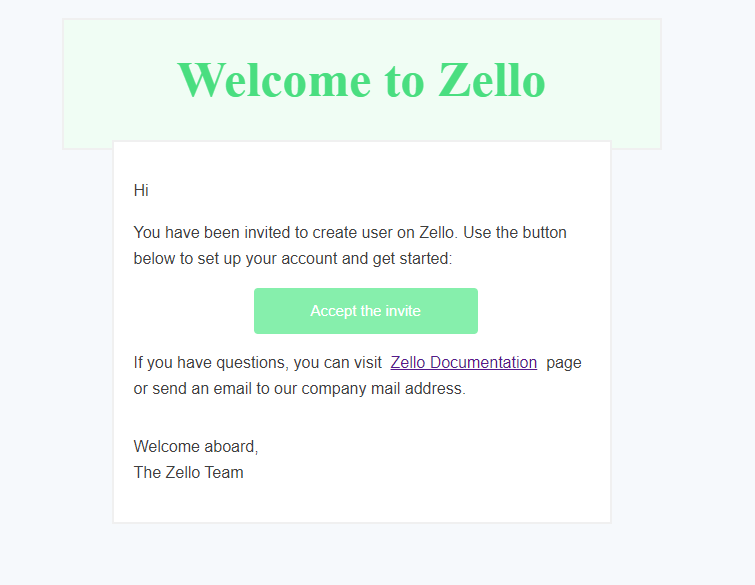
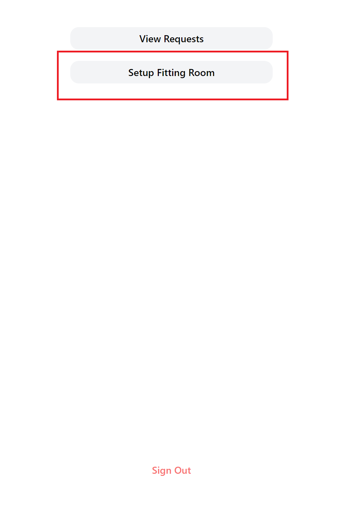
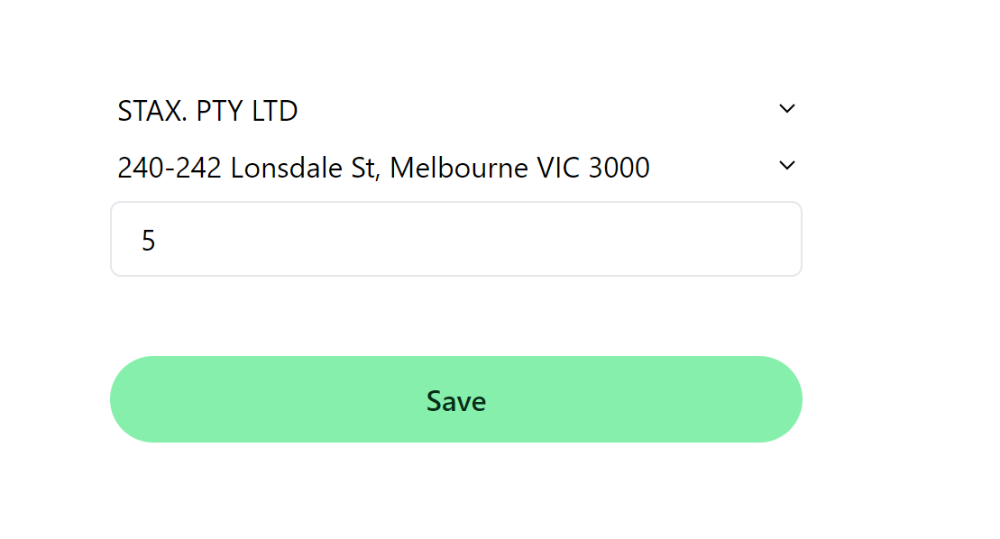
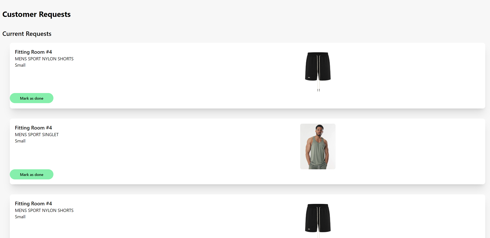
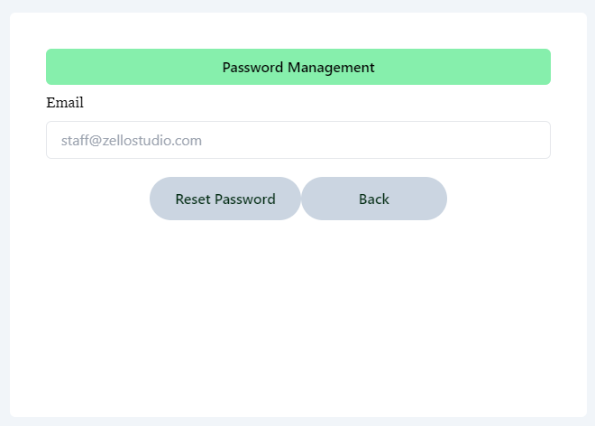
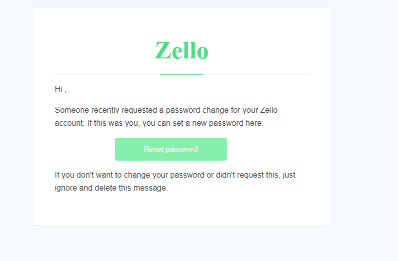

# Welcome to Zello Studio's manual

You are reading this page likely because your company has bought into Zello studio's software. 

Before you begin, make sure you have received an invitation email. If you have not received it, please speak to your manager. 

To start, login via https://www.zellostudio.com/staff/login

## Setup Fitting Room

To setup the fitting room, click on `Setup Fitting Room`

Now choose your copmany and the location. Indicate which fitting room this device is located at. 

### Remember to sign out when you are done!

## Customer Requests

Now click on `View Requests`. These are requests requested by the customers in the fitting room. Please enable notifications so that you can get timely 
notifications when a customer requests. 

When a request is done, mark them as done. 

## Reset Password

To reset the password, click on the reset password link given on the login page. After clicking on the link, you will be redirected to the page where you must enter the registered email with Zello to receive a reset password mail.

When you click on the reset password button, you will get a reset password email from Zello.

